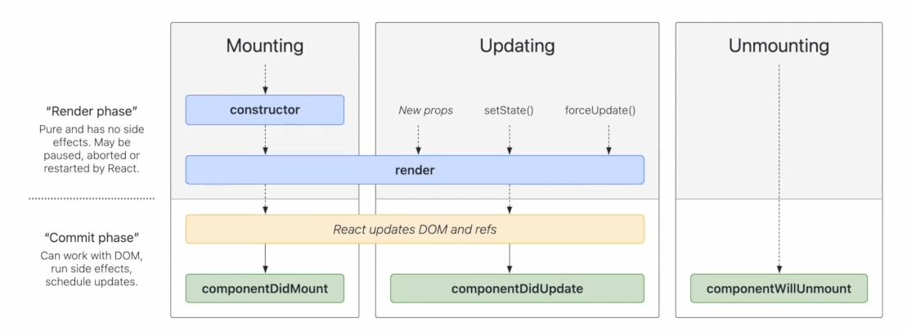

**React**

# Class Based Component in React

- They are the older way of writing react compoenent.
- Class based component are just the normal javascript class.

```javascript
import React from "React";

class Card extends React.Component {
  render() {
    return <div> Hey I'm Class based component </div>;
  }
}

export default Card;
```

## Handling props in Class based component

```javascript
<Card name={"Jack"} />
```

```javascript
import React from "React";

class Card extends React.Component {
  constructor(props) {
    super(props);
    console.log(props);
    this.state = {
      count: 0,
      userData: {},
    };
  }
  render() {
    const { count, userDate } = this.state;
    return <div> {this.props.name} </div>;
  }
}

export default Card;
```

- Whenever we create instance of a class, its constructor is called first
- to access the props anywhere in our class-based component we need to call super(props) in constructor
- Mounting the class based components means `creating new instance` of `React.component` class. While, mounting the functional component means `invoking or call the function`.
- As constructor is called first whenever new instance of class if made so, its the best place to make state variables here.
- To create state in class-based component we do something `this.state`
- To change the state of class-based component, React provide us the `this.setState` function which takes in the object which contains state variables as key and updated value as there value. Eg -

```javascript
this.setState({
  count: this.state.count + 1,
});
```

## Life Cycle Methods in Class-Based Components

### How is class based components mounted?

- New instance of class component is created
- Then firstly `costructor()` is called
- Then the `render()` function is called
- Then the `componentDidMount()` function is called. When component is fully mounted in page then componentDidMount() function is called after the mounting.

```
constructor() => render() => componentDidMount()
```

### Understanding Life Cycle Methods between Parent and Child Class based components in deep

Suppose we have,

```javascript
class ParentComp extends React.Component {
  constructor() {
    console.log("Parent constructor called");
  }
  componentDidMount() {
    console.log("Parent component did mount");
  }
  render() {
    console.log("Parent component rendered");
    return (
      <div>
        <ChildComp />
      </div>
    );
  }
}

class ChildComp extends React.Component {
  constructor() {
    console.log("Child constructor called");
  }
  componentDidMount() {
    console.log("Child component did mount");
  }
  render() {
    console.log("Child component rendered");
    return <div>Hey ! I am child component.</div>;
  }
}
```

```
Output => Parent constructor called
          Parent component rendered
          Child constructor called
          Child component rendered
          Child component did mount
          Parent component did mount

```

- componentDidMount() is the best place to make API Call



Mounting, Updating and Unmounting

- In all this process, there are 2 phases that are **Render Phase** and **Commit Phase**
- If multiple childrens needs to be render then React batch these all childs Render phase and then proceeds the commit phase after all render phase of childrens is completed. Eg -

```javascript
class ParentComp extends React.Component {
  constructor() {
    console.log("Parent constructor called");
  }
  componentDidMount() {
    console.log("Parent component did mount");
  }
  render() {
    console.log("Parent component rendered");
    return (
      <div>
        <ChildComp no={1} />
        <ChildComp no={2} />
      </div>
    );
  }
}

class ChildComp extends React.Component {
  constructor(props) {
    super(props);
    console.log(this.props.no + " Child constructor called");
  }
  componentDidMount() {
    console.log(this.props.no + " Child component did mount");
  }
  render() {
    console.log(this.props.no + " Child component rendered");
    return <div>Hey ! I am child component.</div>;
  }
}
```

```
Output => Parent constructor called
          Parent component rendered
          1 Child constructor called
          1 Child component rendered
          2 Child constructor called
          2 Child component rendered
          1 Child component did mount
          2 Child component did mount
          Parent component did mount

```

- Commit phase is the most expensive phase as it actually manipulates the DOM
- We have functions like `componentDidMount()` `componentDidUpdate()` `componentWillUnmount` in class-based component
- componentWillUnmount() is used for cleanup purposes like clearing setInterval
  Eg -

```javascript
componentDidMount(){
  this.timer = setInterval(()=>{
    console.log("Hello");
}, 1000);

componentWillUnmount(){
  clearInterval(this.timer);
}
```
