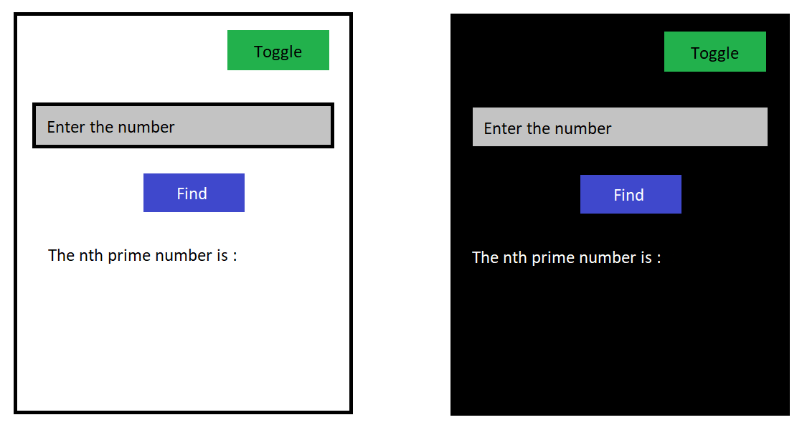
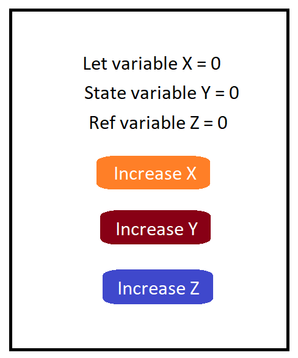

**React**

# Hooks in React

Hooks are just the normal function just like javascript functions.They give you the super powers to build your application. Some core React Hooks are useState(), useEffect(), useRef(), useMemo() and etc.

## useMemo() Hook

useMemo() Hook lets you cache result between re-renders

**Where they are used?**

- To avoid repetitive expensive operations.
- To avoid re-rendering of component.
- For optimizatio purposes

**Syntax**

```javascript
useMemo(()=>{callback}, [Dependency Array]);
```

- Lets understand useMemo() Hook by example. Suppose, we have `Card component` in which we have `number` and `isDarkTheme` State of that component. We have a toggle button to change the isDarkTheme State either true or false. And we have input field whose value is associated to number state. Number state is used to calculate the nth prime number which is a expensive operation to calculate.
- As we know React default behaviour that after every state change the component is re-rendered.
- Here, in case of our example we have two states of compoenent. When we toggle the isDarkTheme state are we suppose to perform the expensive operation again for calculating nth prime number? as the state isDarkTheme changes the component re-renders.
- To memoize this value of calculated nth prime number we need to use useMemo() hook and give it the Dependency Array value as number so that after every number state changes it should re-calculate the nth prime number.



- To overcome this default behaviour of React we need to use useMemo() Hook.

```javascript
const prime = useMemo(() => findPrime(number), [number]);
```

Suppose, we have function `findPrime()` which performs heavy operation of finding out nth prime number and it returns the memoized prime nummber value which can be used to render. And this callback function will only be executed when the number state changes.
Anytime the isDarkTheme state changes it will not perform the heavy operations.

# useCallback()

- Similar to useMemo() Hook but caches the function defination instead of results.

# useRef()

useRef( ) Hooks lets you reference the value that's not needed for rendering.



Lets, understand the let variable, state variable and the Ref variable behaviour in react.js using the example shown above -

- We have the React Functional component which has the let variable X, the state variable Y and the ref variable as Z. All value are initialized to 0 at first.
- We have three buttons to control values of this variables.
- We will study the behaviour of all this variable from above example how they works.
- Also we have onClick handler for each button to increase the values of button such as -

```javascript
let X = 0;
const increaseLetVar = () => {
  X += 1;
  console.log(X);
};
```

```javascript
const [Y, setY] = useState(0);
const increaseStateVar = () => {
  setY(Y + 1);
  console.log(Y);
};
```

```javascript
const Z = useRef;
Z.current = 0;
const increaseRefVar = () => {
  Z.current += 1;
  console.log(Z);
};
```

- When we click the increase X button, the value of X variable increases but it does not render and show the current value in component. But when same increase Y button is clicked the state variable value increase and also the compoenent get re-rendered again as state of componenent changes. But let's now observe the effect on let variable as the componenent gets re-rendered the let variable X get re-initialized to 0 value again and then increase 1 then 2 then 3 and so no...
- The let variable get re-initialized to 0 value when the compoenent re-renders loosing the current value of let X variable it doesn't persists its value during re-renders to overcome this we have useRef() hook.
- In case of ref variable Z it doesn't happens like that, when we click the increase Z button the value of Z variable increase but it does not changes on UI as it doesn't re-renders the compoenent it just increases the value behind the scene. But when state of componenent changes and componenent gets re-rendered the useRef() previous value gets rendered not like the normal let variable X who gets re-initialized to 0 , it persists the previous value during the re-rendering of componenent.
- To actually play with it and understand useRef() Hooks working try this example yourself, below is the react componenent.

```javascript
import React, { useState, useRef } from "react";

const Card = () => {
  let X = 0;
  const [Y, setY] = useState(0);
  const Z = useRef();
  const increaseLetVar = () => {
    X += 1;
    console.log(X);
  };
  const increaseStateVar = () => {
    setY(Y + 1);
    console.log(Y);
  };
  const increaseRefVar = () => {
    Z.current += 1;
    console.log(Z);
  };
  return (
    <div>
      <span>Let Var X : {X}</span>
      <span>State Var Y : {Y}</span>
      <span>Ref Var Z : {Z}</span>
      <button onClick={increaseLetVar}>Increase X</button>
      <button onClick={increaseStateVar}>Increase Y</button>
      <button onClick={increaseRefVar}>Increase Z</button>
    </div>
  );
};
```
